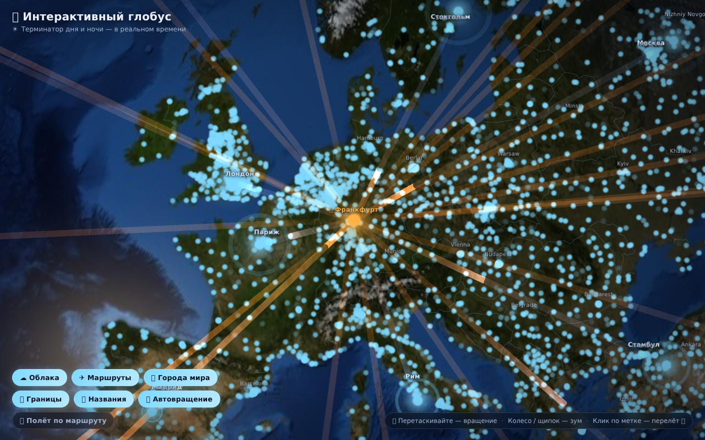
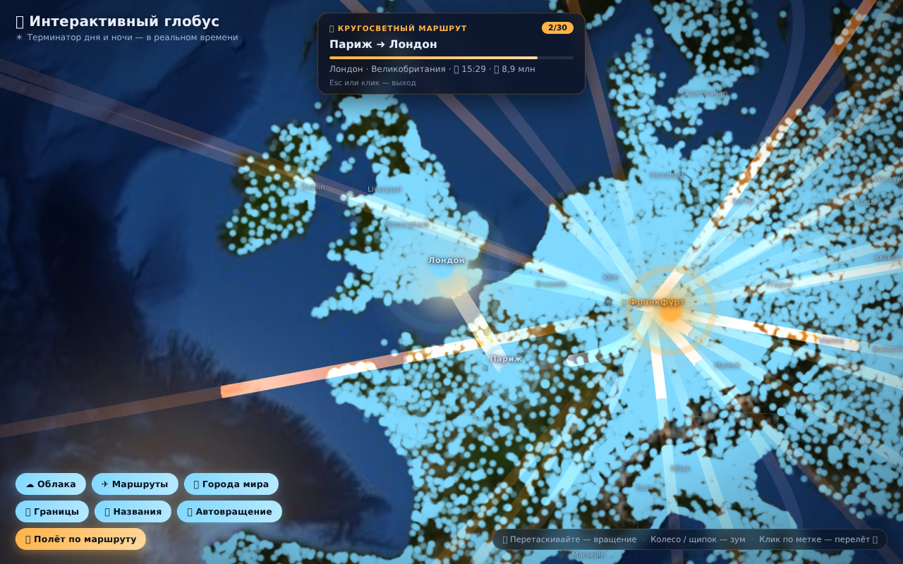

# 🌍 Интерактивный глобус

Фотореалистичный интерактивный 3D-глобус Земли для браузера на [Three.js](https://threejs.org).

| День | Ночь | Приближение | Полёт по маршруту |
|---|---|---|---|
|  |  |  |  |

## Возможности

- **Реальный терминатор дня и ночи** — положение Солнца рассчитывается по текущему времени UTC, ночная сторона Земли подсвечивается огнями городов (текстуры NASA Blue Marble / Black Marble)
- **Солнечные блики на океанах**, тёплая полоса сумерек вдоль терминатора, голубое свечение атмосферы у лимба
- **Процедурные облака** — генерируются кодом (бесшовный fbm-шум), медленно дрейфуют над планетой
- **Звёздное небо** и Солнце на орбите (скрывается за планетой)
- **💡 Все города мира — 122 445** (GeoNames, население 1000+): облако точек с уровнем детализации — вдали светятся миллионники, при приближении проступают города всё мельче; точки тёпло-янтарные на ночной стороне и голубые на дневной
- **🗺 Все страны**: 229 стран с русскими названиями и флагами (названия появляются при отдалении), контуры границ всех государств
- **Наведение на любой город мира** — карточка: название, страна (по-русски), население и солнечное время; клик — перелёт
- **30 избранных городов** с метками, местным временем (учёт часовых поясов и DST через `Intl`), населением и страной
- **Анимированные маршруты** из Франкфурта-на-Майне во все города — «кометы» летят по дугам большого круга
- **🛫 Режим «Полёт по маршруту»** — кругосветное путешествие по всем городам: камера летит по дугам большого круга, HUD показывает перелёт, прогресс и карточку города. Выход — Esc или клик
- **Полёт камеры** — клик по любой метке плавно перелетает к городу
- Управление: перетаскивание — вращение, колесо/щипок — зум, автовращение с паузой при взаимодействии

## Запуск

Глобус — статический сайт, достаточно любого HTTP-сервера:

```bash
# Python
python3 -m http.server 8000

# или Node
npx serve .
```

Откройте http://localhost:8000

## Структура

```
index.html              — разметка, экран загрузки, панель управления
css/style.css           — стили (тёмная «стеклянная» тема)
js/main.js              — вся логика и шейдеры (Земля, облака, атмосфера, города, дуги, тур)
js/vendor/              — Three.js r160 и OrbitControls (вендорные копии)
assets/                 — текстуры NASA: день, ночь, маска воды, звёздное небо
data/                   — 122 тыс. городов, страны, границы (собирается из датасетов)
scripts/build-data.mjs  — сборка data/ из npm-датасетов (GeoNames, world-countries, world-atlas)
scripts/*.mjs           — тесты в headless Chromium (SwiftShader WebGL)
```

## Данные

Источники (через npm, офлайн): [all-the-cities](https://github.com/eeba/all-the-cities) (GeoNames, CC-BY 4.0), [world-countries](https://github.com/mledoze/countries) (русские названия стран), [world-atlas](https://github.com/topojson/world-atlas) (границы, Natural Earth).

```bash
npm run build:data   # пересобрать data/ (нужны devDependencies: npm install)
```

## Технологии

- [Three.js](https://threejs.org) r160 (WebGL, кастомные GLSL-шейдеры)
- Текстуры из пакета [three-globe](https://github.com/vasturiano/three-globe) (спутниковые снимки NASA)
- Облака — процедурная генерация canvas-текстуры на JS
- Без сборки: ES-модули + import map

## Тесты

Смоук-тест в headless Chromium (SwiftShader WebGL): запуск без ошибок JS/шейдеров,
рендер Земли, ночные огни, метки городов, переключатели.

```bash
python3 -m http.server 8000 &   # сервер
npm run test                    # смоук-тест (нужен devDependencies: npm install)
npm run test:tour               # тест режима полёта
```
